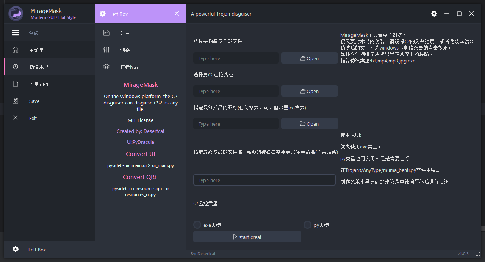

# 🚀 MirageMask  
✨ **Brief Description**: A Red Team testing tool library for Windows-based systems, specializing in Trojan camouflage operations.  
[](https://github.com/yourname/project)  
[](https://github.com/yourname/project/actions)  
  

## 🌐 Languages  
- [English](README.en.md)  
- [简体中文](README.md)  
- [Español](README.es.md)  
- [日本語](README.ja.md)  

## ⚠️ **Legal Disclaimer**  
```text  
• This tool is strictly limited to **legally authorized security testing**. Prohibited uses include:  
  ⛔ Unauthorized penetration testing | ⛔ DDoS attacks | ⛔ Data theft  
• Users are solely responsible for ensuring compliance with Article 285 of the Criminal Law and Article 27 of the Cybersecurity Law of China.  
• Developers **bear no liability** for civil/criminal consequences arising from misuse.  

  
Full terms: [Legal Notice](../legal/DISCLAIMER.md)  

## 🌟 Features  
- ✅ File Camouflage for arbitrary Windows files  
- 🚄 Large-file Entry Point Hijacking  
**Planned Features**  
- 🔒 Icon Extraction from files  
- 🔒 EXE Icon Modification  

## 🔰 UI Preview  
  

## 🛠️ Quick Start  
### Prerequisites  
```bash  
python 3.8+  
pyinstaller  
```
  

### Installation  
```bash  
git clone https://github.com/yourname/project.git  
pip install -r requirements.txt  
pip install pyinstaller  
```
  

## 🤝 Contribution Guidelines  
1. Fork the repository  
2. Create a feature branch  
3. Commit changes with clear descriptions  
4. Push to the branch  
5. Open a Pull Request  

## 📜 License  
Licensed under [Apache 2.0](LICENSE).  

---  
## ⭐ Author's Bilibili  
【Momo the Coding Cat’s Bilibili Space】[https://b23.tv/nKcZ1pB ](https://b23.tv/nKcZ1pB ) 

---  
## ⚜️ Acknowledgments  
UI Template: [PyDracula](https://github.com/Wanderson-Magalhaes/PyDracula)  

## ⚠️ Customization Notes  
- Bundling code is located in `/Trojans`.  
- Current implementation prioritizes minimalism to reduce detection risks.  
- For real-world scenarios (e.g., network defense exercises), apply additional encryption, obfuscation, and anti-reverse engineering measures.  
- Payloads with anti-VM/debugging features enhance authenticity, mimicking benign applications.  

