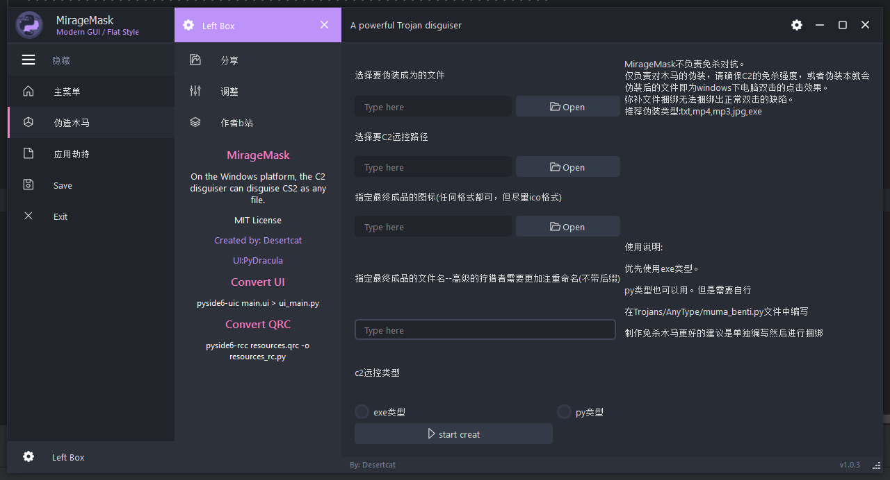

# 🚀 MirageMask

✨ **简要描述**：这是一个红队测试工具库，针对windows类主机，负责红队木马的伪装工作。

[](https://github.com/yourname/project)
[](https://github.com/yourname/project/actions)


## 🌐 语言
- [English](README.en.md)
- [简体中文](README.md)
- [Español](README.es.md)
- [日本語](README.ja.md)

## ⚠️ **法律免责声明**  
```text
• 本工具仅限用于**合法授权的安全测试**，禁止用于：  
  ⛔ 未授权渗透 | ⛔ DDoS攻击 | ⛔ 数据窃取  
• 使用者需自行确保符合《刑法》285条及《网络安全法》27条规定  
• 开发者**不承担**任何滥用导致的民事/刑事责任  
```
完整条款见 [法律声明](../legal/DISCLAIMER.md)  

## 🌟 功能
- ✅ 功能 1 windows任意文件伪装
- 🚄 功能 2 大型文件入口劫持

未来计划添加的功能
- 
- 🔒 功能 3 扣取文件图标
- 🔒 功能 4 更改exe程序图标

## 🔰 界面预览



## 🛠️ 快速开始

### 前提条件
```bash
python 3.8+
pyinstaller
````

### 安装
```bash
git clone https://github.com/yourname/project.git
pip install -r requirements.txt
pip install pyinstaller
```


## 🤝 贡献
1. Fork（分叉）该仓库
2. 创建功能分支
3. 进行修改并提交
4. 推送到分支
5. 创建 Pull Request（拉取请求）

## 📜 许可证
该项目采用 [Apache 2.0](LICENSE) 许可证。

---

## ⭐ 作者b站
【躲在深山敲键盘的漠猫的个人空间-哔哩哔哩】 https://b23.tv/nKcZ1pB

---

## ⚜️ 项目支持
UI界面模板:PyDracula

## ⚠️ 魔改帮助
捆绑代码位于Trojans文件夹中。  
因指纹与查杀的可能性，当前为最简效果实现方式。  
如果是真正护网等实战中，需要自行对某些文件进行特定的加密混淆，反逆向等操作。  
当然如果载荷经过了反虚拟机反调试等，也具有更好的迷惑性，更像一个无辜的小程序  

